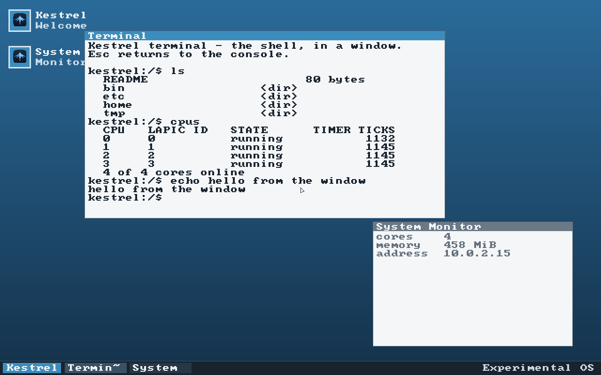
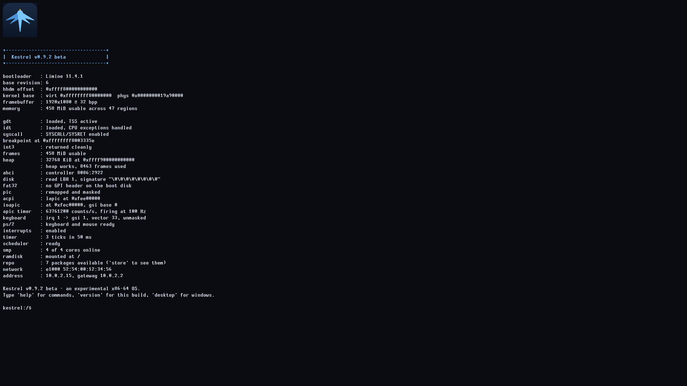
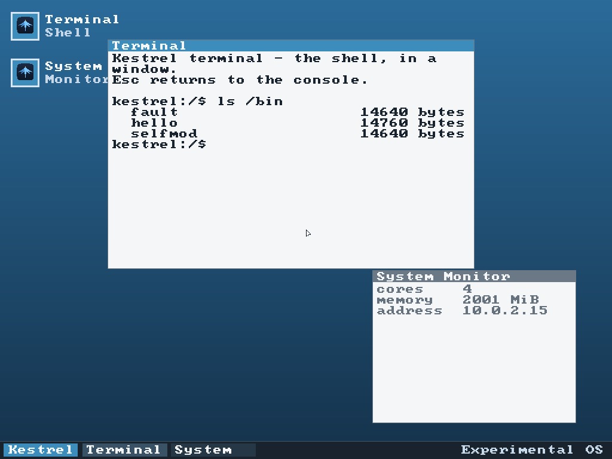

# Kestrel

An x86-64 operating system written from scratch in Rust, booted by
[Limine](https://github.com/limine-bootloader/limine) under UEFI.

It boots on real UEFI firmware, drives the framebuffer, keyboard and mouse
itself, manages its own page tables, preemptively schedules across every core,
speaks TCP/IP over its own network driver, reads and writes a FAT32 disk, and
loads ELF programs into isolated address spaces where they run in ring 3 behind
a `syscall` interface — from a shell that runs either on the console or inside
a window on its own compositor.

Everything below the bootloader is original: no libc, no drivers borrowed from
anywhere, no kernel to fall back on.

## Beta

**This is beta software.** It boots, it is usable, and it will not eat your
computer — but it has no security model, no filesystem consistency checking and
no recovery of any kind. **Run it in a virtual machine.** Do not attach a disk
whose contents you would miss.

Download `kestrel-<version>.iso` from
[Releases](https://github.com/AverageCodeNerd/Kestrel/releases) and boot it in
any VM set to **UEFI firmware with Secure Boot off**. That is the only
requirement. Check it against `SHA256SUMS` if you like — a truncated download
looks exactly like a kernel that fails to boot.

The build is **reproducible**: cloning this repository and running
`.\release.ps1` produces images whose SHA-256 hashes match the published ones
exactly, so you never have to take a binary on trust. `kestrel.vhd` is the same
system as a hard disk image, which is the better choice if you want files to
survive a reboot — booted from the ISO there is no writable disk, so `/disk`
is absent.

Type `help` for the command list, `version` for what this build is, and
`desktop` for the windowed interface (Esc returns to the console).

Known limitations are listed under [Status](#status); the short version is that
there is no TLS, so `fetch` reaches http:// but not https://.

## Making it yours

Open the launcher and pick **Settings** — presets, toggles and steppers, all
applying as you click them. `open settings` does the same from the keyboard,
which matters on machines with no working mouse.

Everything there is also a shell command, because the Settings window and the
`set` command drive the same theme module rather than each keeping their own
idea of what a setting is:

```
theme                       list every setting and its value
theme amber                 default, midnight, paper, amber, matrix
set panel.top on            move the panel to the top edge
set scale 3                 bigger text — everything measured in
                            characters resizes with it
set desktop.top #204060     any #rrggbb, or a name like 'blue'
set status.text Hello       the panel's corner text
theme save                  keep it, at /disk/desktop.conf
```

Settings are loaded at boot, so the desktop is already yours the first time you
open it. The file is plain `key = value` text and can be edited directly;
unknown keys and bad values are reported and skipped rather than being allowed
to stop the desktop starting.

Saving needs a writable disk, so it works when booting the `.vhd` or `.img` but
not from the ISO.

## What it looks like

The shell, running inside a window on Kestrel's own compositor. Every command
works the same here as on the console — output is the same byte stream, routed
into a terminal window rather than the text console.



Booting: Limine hands off, and the kernel brings up memory, interrupts, disk,
all four cores and the network before dropping to a prompt.



The same system booted from the release ISO under VirtualBox.



```
kestrel:/$ exec /bin/hello
exec: hello entry 0x400a70, image ends at 0x402010
exec: started task 1
hello from a real ELF binary in ring 3
  my pid is 1
  1: step 1
  done
kestrel:/$ exec /bin/fault
about to read kernel memory from ring 3...

[segmentation fault at 0x400047, accessing 0xffffffff80000000: killed]
kestrel:/$ ps
  ID   NAME         RING  STATE        QUANTA
  0    kmain        0     runnable          5  <- running
  1    hello        3     exit 0            4
  2    fault        3     exit 139          1
```

A misbehaving program is killed on its own; the kernel keeps running.

## Running it

```bash
cargo xtask run
```

Builds the kernel, stages an EFI system partition under `build/esp`, and boots
it in QEMU with a window and serial on stdio.

```bash
cargo xtask image --release                       # build .img, .vhd and .iso
cargo xtask iso --release                         # just the ISO
cargo xtask run --release
cargo xtask run --image                           # boot the real disk image
cargo xtask run --vhd                             # boot the VHD, to check that wrapper
cargo xtask run --iso                             # boot the ISO from a virtual DVD
cargo xtask run --headless --timeout 8            # no window; serial to build/serial.log
cargo xtask run --screenshot build/boot.png       # capture the framebuffer
cargo xtask run --keys "ls\nps\n"                 # type into the guest, then exit
cargo xtask run --image --keep-image              # don't regenerate the disk
```

`--keys` also names keys that have no character, inline: `"ab{left}X{up}"`.

`--keep-image` preserves whatever the guest wrote to the disk. Note that the
kernel lives on that image too, so keeping it also keeps the kernel that was
there — drop the flag after rebuilding.

Build images with `--release`. The debug kernel is 3.9 MB against 220 KB
optimised, and booting that off an emulated CD takes about half a minute.

A halted kernel never exits QEMU, so `--headless`, `--keys`, and `--screenshot`
runs are bounded by `--timeout` (default 5s). An interactive `cargo xtask run`
is closed by closing the QEMU window.

`--keys` injects real PS/2 scancodes through the QEMU monitor, so it exercises
the actual keyboard driver. That is how the shell is tested.

## Running it in a VM

`cargo xtask image --release` produces three files:

- `build/kestrel.img` — 64 MiB raw GPT disk with a FAT32 EFI system partition
- `build/kestrel.vhd` — the same image with a fixed-format VHD footer
- `build/kestrel.iso` — 16 MiB bootable disc image, for a virtual DVD drive

**The VM must be set to boot UEFI, not BIOS** — Kestrel has no legacy boot
path — and **Secure Boot must be off**, because Limine is not signed.

- **Hyper-V** — new VM, Generation 2. Either attach `kestrel.vhd` as an
  existing hard disk, or attach `kestrel.iso` to the DVD drive and move it up
  in the firmware boot order. The VHD is the simpler of the two.
  **The keyboard will not work — see below.**
- **VirtualBox** — tick System → Enable EFI, then attach `kestrel.vhd` to the
  SATA controller or `kestrel.iso` to the optical drive.
- **VMware** — set `firmware = "efi"` in the `.vmx`, then attach the ISO, or
  convert the disk with `qemu-img convert -O vmdk kestrel.img kestrel.vmdk`.

The ISO carries two filesystems, which is easy to get wrong when modifying it.
A FAT16 volume is embedded as the El Torito boot image, and firmware loads
`EFI/BOOT/BOOTX64.EFI` from it. Limine then reads the surrounding ISO 9660
filesystem to find `limine.conf` and the kernel. Since ISO 9660 names are 8.3
and uppercase, the real names are carried in Rock Ridge `NM` entries. FAT16
rather than FAT32 because the boot catalog records the image size as a 16-bit
count of 512-byte sectors, capping it below FAT32's minimum size.

The ISO also carries a protective MBR and a GPT describing that same embedded
FAT16 volume as an EFI system partition — the equivalent of `xorriso`'s
`-efi-boot-part --protective-msdos-label`. Without it, firmware hands Limine a
boot handle it cannot match to any volume, and it stops with "Could not
meaningfully match the boot device handle with a volume… Press any key",
which makes the disc unbootable unattended. Two constraints come with it: the
partition table lives in the ISO 9660 system area (the reserved first 32 KiB),
and **the image length must stay a whole multiple of 2048 bytes** or VirtualBox
will not attach the file at all, reporting only `VERR_NOT_SUPPORTED`.

### Hyper-V has no PS/2 keyboard

Generation 2 VMs are UEFI-only with synthetic devices: there is no i8042
controller, and the keyboard is a VMBus device. Kestrel has no VMBus driver, so
the boot log appears and the prompt sits there ignoring you. It says so at
boot: `ps/2 : no keyboard - use the serial console for input`.

Generation 1 VMs *do* have a PS/2 keyboard, but they boot BIOS rather than
UEFI, and these images are UEFI-only — so if it boots on Hyper-V at all, it is
Generation 2 and the keyboard is unavailable.

The way in is the serial console. Give the VM a COM port backed by a named
pipe:

```powershell
Set-VMComPort -VMName Kestrel -Number 1 -Path \\.\pipe\kestrel
```

Then attach a terminal to that pipe — PuTTY takes `\\.\pipe\kestrel` as its
serial line — and you get the same shell, with line editing and history. The
serial console is a first-class input: everything works there.

If you would rather have a window and a real keyboard, QEMU (`cargo xtask run`)
and VirtualBox with EFI enabled both emulate a PS/2 controller.

## Requirements

- Rust nightly (pinned by `rust-toolchain.toml`). Nightly is required, not
  preferred: `abi_x86_interrupt` is still unstable.
- The `x86_64-unknown-none` target, installed automatically by that file.
- QEMU, with its bundled `edk2-x86_64-code.fd` UEFI firmware. Set `QEMU_DIR` if
  it is not at `C:\Program Files\qemu`.

No C cross-compiler is needed — `x86_64-unknown-none` links with the bundled
`rust-lld`.

## Layout

```
kernel/
  linker.ld          higher-half layout and the Limine request sections
  build.rs           passes the linker script and page size to rust-lld
  src/main.rs        entry point, Limine boot requests, boot sequence
  src/console.rs     framebuffer text console
  src/font.rs        8x8 bitmap font
  src/serial.rs      16550 UART, the debug log
  src/print.rs       println! fanned out to both, interrupt-safe
  src/gdt.rs         GDT, TSS, IST and ring-0 stacks
  src/interrupts.rs  IDT, CPU exceptions, hardware vectors
  src/pic.rs         legacy 8259, remapped then masked
  src/pit.rs         8254, used only to calibrate the APIC timer
  src/acpi.rs        RSDP/XSDT/MADT parsing to find the APICs
  src/apic.rs        local APIC, timer, I/O APIC routing
  src/keyboard.rs    PS/2 scancode set 1
  src/hhdm.rs        the bootloader's direct map
  src/memory.rs      frame allocator, page mapping, address spaces
  src/pci.rs         PCI configuration space
  src/ahci.rs        AHCI (SATA) driver, read-only, polled DMA
  src/gpt.rs         GPT parsing, to find the EFI system partition
  src/fat.rs         read-only FAT32, mounted at /disk
  src/allocator.rs   kernel heap, a coalescing free list
  src/task.rs        context switch and round-robin scheduler
  src/syscall.rs     SYSCALL/SYSRET entry and dispatch
  src/usermode.rs    dropping to ring 3
  src/elf.rs         ELF64 loader
  src/process.rs     ELF image -> running process
  src/vfs.rs         in-memory filesystem
  src/shell.rs       the interactive shell
user/
  hello/             a userspace program: prints, yields, exits
  fault/             reaches for kernel memory, and is killed for it
  selfmod/           tries to rewrite its own code, and is killed for it
xtask/
  src/main.rs        build driver: compile, stage, image, launch QEMU
  src/fat.rs         FAT32 formatter, including long filenames
  src/image.rs       GPT partitioning and the VHD footer
  src/png.rs         PPM screendumps to PNG, dependency-free
  src/crc.rs         CRC-32, shared by PNG chunks and GPT headers
limine/              prebuilt Limine v11 binaries; a shallow clone of the
                     upstream `v11.x-binary` branch, so it carries its own
                     .git — delete that (or make it a submodule) before
                     committing Kestrel. Refresh with `git -C limine pull`.
```

## Notes on the design

**Boot.** Limine is a UEFI application. The kernel is a static `ET_EXEC` ELF
linked at `0xffffffff80000000`; Limine's loader takes both that and
position-independent kernels, and the fixed-address form means nothing needs
relocating at load time. Communication happens through structs in the
`.limine_requests` section, bracketed by start/end markers.

**MMIO is not in the direct map.** Limine direct-maps RAM, but not device
registers. The APIC pages have to be mapped by the kernel before first touch —
which is why memory management has to come up before interrupts.

**ACPI is parsed with unaligned reads throughout.** ACPI tables are byte-packed
and the XSDT's array of 64-bit table pointers begins at offset 36, so it is
never 8-byte aligned. Naive typed reads would be undefined behaviour.

**Interrupt handlers never print or allocate.** They can preempt code holding
those locks, and a spinlock taken twice on one CPU is a hang. Handlers only
touch atomics and ring buffers. Correspondingly, `println!` masks interrupts
for its critical section, so a task cannot be preempted mid-print.

**Long filenames are load-bearing.** The bootloader insists on a file named
`limine.conf`, and a four-character extension does not fit an 8.3 short name —
so the FAT32 writer has to emit real long-filename entries.

## Processes

`exec` loads an ELF file into a brand-new address space and puts it on the run
queue. Each process gets its own page tables, so several can be resident at
once — all linked at the same address, `0x400000`, without colliding — and each
gets its own ring-0 stack, so an interrupt taken in user mode never lands on
another process's kernel state.

Programs can come from either filesystem. `/bin` is populated at boot from the
modules Limine loads, which works on any medium including a CD. `/disk` is the
real thing: the boot disk's EFI system partition, read over AHCI and parsed as
FAT32, so `exec /disk/bin/hello` pulls the image off the actual disk.

## The disk

`pci.rs` walks configuration space over ports 0xCF8/0xCFC looking for a
mass-storage controller with the AHCI interface. AHCI rather than virtio-blk
because QEMU, Hyper-V and VirtualBox all present SATA, so one driver covers
every target.

The controller is a DMA master: it reads its command list out of RAM and writes
sector data back, all by *physical* address. That is why those buffers come
from the frame allocator rather than the heap — the heap hands out virtual
addresses whose physical backing is neither known nor contiguous. Transfers are
polled rather than interrupt-driven, which is simpler and fast enough when the
only reads happen on `exec`.

`/disk` is read-write, so anything written there survives a reboot:

```
kestrel:/$ write /disk/notes.txt kestrel remembers this
kestrel:/$ reboot
...
kestrel:/$ cat /disk/notes.txt
kestrel remembers this
```

`mkdir` and `rm` work there too; removing a directory requires it to be empty.

Writing means allocating a cluster chain, updating *both* copies of the FAT —
they are mirrored, and updating only one leaves the volume inconsistent for
anything else that reads it — and creating or rewriting the directory entry.
The contents are laid down before the directory entry is touched, so a failure
part-way leaves the old file intact rather than a directory pointing at a
half-written one. A new directory is seeded with `.` and `..`, which are real
entries on disk rather than something the filesystem invents; a `..` pointing
at the root is recorded as cluster 0 by convention.

Names that differ from their 8.3 form only by case — `docs`, `readme.txt` —
are stored in the short entry with a flag saying which half to lowercase, and
need no long-name entries. Anything else, `MixedCase.TXT` included, gets a
proper long-name group. The formatter in `xtask` and the kernel driver share
this behaviour, so an image looks the same whichever wrote it.

## Multiple cores

Limine takes the other cores out of reset and parks them, so bringing them up
is a matter of writing a function pointer rather than hand-writing a real-mode
trampoline. Each then builds its own world: its own GDT and TSS, its own local
APIC and timer, and its own `EFER` bits — that register is per-core, and
forgetting NX on one core makes every no-execute page fault there and nowhere
else.

Each core has its own run queue, and `spawn` places a task on the shortest one.
Tasks are **pinned** and never migrate. That is deliberate: migration means one
core marking a task runnable while it is still executing on another, and the
window between "released" and "context actually saved" is a race that corrupts
the task's stack. Pinning closes the window, at the cost of no rebalancing
afterwards.

The system call path needs per-core state, since two cores can be inside a call
at once. That state is reached through `swapgs`, with the kernel pointer kept in
the *shadow* GS base so a user program cannot reach it — and, more to the point,
cannot break the entry path by loading a GS selector, which would zero the base
the stub depends on.

One consequence is easy to miss: `exit` never returns, so the entry `swapgs` has
no matching one on the way out, and the next system call on that core would swap
a zero base in and fault on its first instruction. Every path that kills a task
funnels through `task::finish`, which resets both bases outright rather than
relying on the swaps balancing.

`cargo xtask run --cpus N` sets the core count; the default is 4. `cpus` in the
shell lists them.

## Using the shell

The line editor supports left/right, home/end, delete, and command history on
up/down. `help` lists every command; the ones worth knowing:

```
exec <file>     run an ELF program in its own address space
ps / kill <id>  list and stop tasks
mem             memory and filesystem statistics
reboot          restart, via the 8042 with a triple-fault fallback
shutdown        power off
```

Finished tasks are reaped from the shell's idle loop, which returns their
stacks, page tables, and frames to the allocator — a task cannot free the
stack it is still standing on, so it has to be collected after it is gone.
Freed frames go on an intrusive free list, with the link stored inside each
free frame, because the frame allocator has to work before the heap exists —
it is what the heap is built from.

Segments get the permissions the ELF asks for: code is read-execute, data is
read-write-noexecute, and the stack is never executable. Nothing is
temporarily mapped writable during loading, because the loader copies contents
through the direct map rather than through the process's own mapping.

Marking pages non-executable requires `EFER.NXE`; without it the CPU treats
bit 63 of a page table entry as reserved and *every* access to such a page
faults. `exec /bin/selfmod` demonstrates the result — it tries to rewrite its
own code, is killed, and the kernel carries on.

The system call ABI follows Linux: number in RAX, arguments in RDI/RSI/RDX,
result in RAX. Every general-purpose register is preserved except RAX, and
RCX/R11, which the `syscall` instruction itself overwrites. That last part is
load-bearing — the kernel's entry stub has to save the argument registers and
r8-r10 by hand, because the Rust function it calls will otherwise clobber them,
and a program built with optimisations *will* notice.

Calls are `write`, `exit`, `getpid`, and `yield`. Adding one means a new arm in
`syscall.rs` and a wrapper in the user program.

## Status

Working: UEFI boot, framebuffer console, serial logging, GDT/TSS, full CPU
exception handling, local and I/O APIC, a calibrated 100 Hz timer, PS/2
keyboard and mouse, a physical frame allocator, kernel page-table control, a
heap backing `Box`/`Vec`/`String`, preemptive scheduling across every core,
per-process address spaces, an ELF loader, ring 3 with SYSCALL/SYSRET, W^X
enforced with the NX bit, PCI, an AHCI disk driver, GPT, read-write FAT32, an
e1000 network driver with ARP/IPv4/ICMP/UDP/DNS/TCP, a windowed compositor with
damage tracking, a shell that runs on the console or inside a window, and
bootable disk and disc images.

### Known limitations

Things a beta tester will actually run into, worst first:

- **No TLS**, so `https://` is out of reach, and `fetch` is a client rather
  than a browser — nothing parses or renders HTML.
- **Booting the ISO gives you no writable disk.** `/disk` only exists when
  booting the `.vhd`/`.img`; from a virtual DVD, only the in-RAM filesystem is
  present and nothing survives a reboot.
- **The keyboard does not work on Hyper-V.** Generation 2 VMs have no PS/2
  controller. Use the serial console — see above.
- **One window of each kind.** Windows can be closed with the button on their
  title bar and reopened from the launcher or the desktop shortcuts, but there
  is no way to have two terminals at once.
- **`kill` is blunt.** It stops a task from ever being scheduled again, so a
  task killed while holding a lock leaves that lock held forever. Good enough
  for stopping a runaway program, not a general mechanism.
- **Tasks never migrate between cores.** They are pinned where they are
  spawned, so a core can end up idle while another has a queue. Work stealing
  would need the release/save race below solved properly.
- **No `fork`/`exec` split** — `exec` always makes a new process rather than
  replacing the caller.
- **Shutdown is best-effort.** A proper ACPI power-off needs the `\_S5` object
  from the DSDT, which is AML bytecode; this tries the ports emulators
  recognise and halts cleanly if none answer.
- **No security model at all.** There are no users, no permissions and no
  validation of anything a program does beyond what the hardware enforces.
